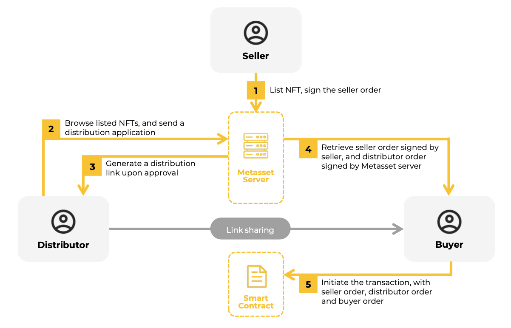

# Hybrid off-chain / on-chain orders

* Seller order created and stored offchain, using EIP-712 signatures, signed by the seller
* Distributor order created and stored off-chain, using EIP-712 signatures, signed by Metasset
* Buyer order executed on-chain

# Two token types can be transferred through Metasset
* ERC-721: Non-Fungible Token Standard, 1 token per transaction
* ERC-1155: Multi-Token Standard, 1+ tokens per transaction

# Transaction steps
* Seller lists an NFT item with all details (NFT collection address,
token ID, price, amount, strategy, distributor percentage etc.).
The seller order is signed by the seller, and stored on Metasset
server.
* Distributor picks the NFTs to be promoted, and sends an
application to Metasset.
* Metasset approves distributor’s application by signing the
distributor order. The distributor order is stored on Metasset
server. A distributor link is generated by Metasset server.
* Buyer uses the link shared by the distributor to initiate a
transaction. Buyer retrieves the seller order and distributor
order with EIP-712 signatures from Metasset.
* Smart contract validates the seller order, distributor order and
buyer order, calculates and processes the protocol fee,
distributor fee, royalty fee, and pays the seller.